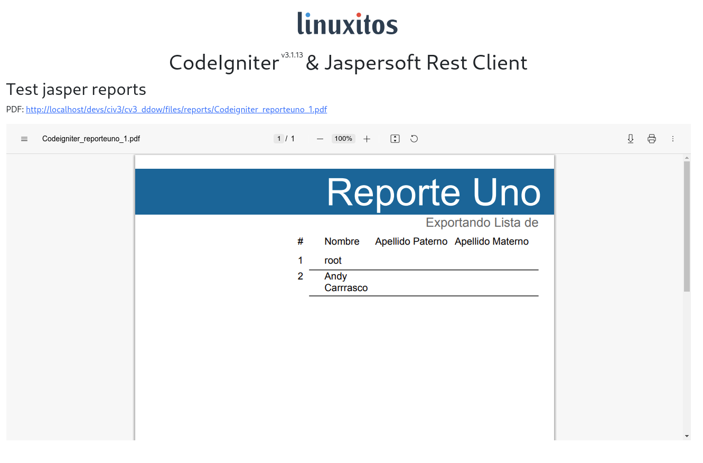

# CodeIgniter 3 con Jaspersoft Rest Client



## Qué es CodeIgniter?

CodeIgniter es un framework de desarrollo de aplicaciones web de código abierto y basado en PHP. Fue creado por EllisLab y ahora es mantenido por la comunidad de desarrolladores. CodeIgniter proporciona una estructura ligera y sencilla para desarrollar aplicaciones web rápidas y eficientes, siguiendo el patrón de diseño MVC [official site](https://codeigniter.com).

## Qué es Jaspersoft Rest Client?

Es una librería que se utilizar para realizar peticiones e interactuar con los reportes alojados en Jasper Reports Server a través de la API REST en PHP nativo. Esto permite incrustar más fácilmente los datos en el servidor de reportes, o realizar tareas administrativas en el servidor utilizando PHP.

## Requerimientos para éste ejemplo

- SO Fedora 38 (Puede usarse otro SO, sin embargo se utilizó una distro GNU/Linux)
- XAMPP 7.4
- PHP 7.4
- Codeigniter 3 (Sólo es soportado hasta la versión 8, por tal motivo se usó PHP 7.4)
- Jaspersoft Rest Client 2.0
- Composer

## Installación de Jaspersoft Rest Client en Codeigniter 3

### Configuración de Jasper Server
** Importante! Se asume que se cuenta con Jasper Server configurado y con al menos un reporte, ya sea con conexión a base de datos o no.

### Descargar Codeigniter 3

Ir al [official site](https://codeigniter.com) y descargar la versión 3, éste ejemplo es para la versión 3.


### Descomprimir el archivo en htdocs de xampp

Entrar al proyecto desde la terminal y descargar el paquete:


```
composer require jaspersoft/rest-client
```

### Configuración de codeigniter

Crear un archivo llamado .htaccess en el proyecto y añadir el siguiente código

```
RewriteEngine On
RewriteCond %{REQUEST_URI} ^/system.*
RewriteRule ^(.*)$ index.php?/$1 [L]
RewriteCond %{REQUEST_FILENAME} !-f
RewriteCond %{REQUEST_FILENAME} !-d
RewriteRule ^(.+)$ index.php?/$1 [L]
```


### Configurar config/config.php

Modificar y añadir la url completa del directorio del proyecto

```
$config['base_url'] 	= 'http://localhost/codeigniter-jasper/';
```

Quitar la configuración que se utilice index.php para acceder en la url

```
$config['index_page'] = '';
```

Verificar que el uri protocol sea REQUEST_URI

```
$config['uri_protocol']	= 'REQUEST_URI';
```

### Configurar autoload

Añadir que se autocarguen los siguiente elementos:

```
$autoload['helper'] = array('reports', 'file', 'url');
```

### Añadir archivo helper llamado reports

Crear en dentro del directorio helpers  el archivo reports_helper.php y añadir lo siguiente
** Aquí se configura la jasper server, por lo que si las contraseñas o dirección url, no corresponden a las predeterminadas, realizar el cambio

```
<?php
require_once "vendor/autoload.php";
use Jaspersoft\Client\Client; 

function reporte($idRegistro, $name, $params, $type = 'pdf')
{
	$ci = &get_instance();
    try {
		$client = new Client('http://localhost:8080/jasperserver', 'jasperadmin', 'jasperadmin');
        $report = $client->reportService()->runReport('/reports/'.$name, $type, null, null, $params);
        $nombre_temporal = str_replace('/', '_', $name).'_'.$idRegistro.'.'.$type;
		$config['upload_path'] 		= './files/reports/';
		/* $config['max_size']     	= '1000000';
		$config['max_width'] 		= '10240000000';
		$config['max_height'] 		= '76889';
		$config['encrypt_name'] 	= true;
		$config['allowed_types'] 	= 'jpg|jpeg|png|gif|pdf';
		$config['file_name'] 		= $nombre_temporal; */
		write_file($config['upload_path'].$nombre_temporal, $report);
        return 'files/reports/'.$nombre_temporal;
    } catch (Throwable $error) {
        return 'error '.$error;
    }
}
```

## Adicional el controlador y la vista ya están en el repositorio para su uso


## Crédito
Éste código es mi autoría y utilizando los siguientes enlaces como ayuda:

- https://stackoverflow.com/questions/39633886/how-to-integrate-jasper-reports-in-codeigniter-php
- https://blog.e-zest.com/integration-of-jaspersoft-report-php-codeigniter-web-framework
- https://forum.codeigniter.com/thread-77397.html
- https://forum.codeigniter.com/thread-1202.html

## Licencia

Y por supuesto:

[](https://opensource.org/licenses/MIT)